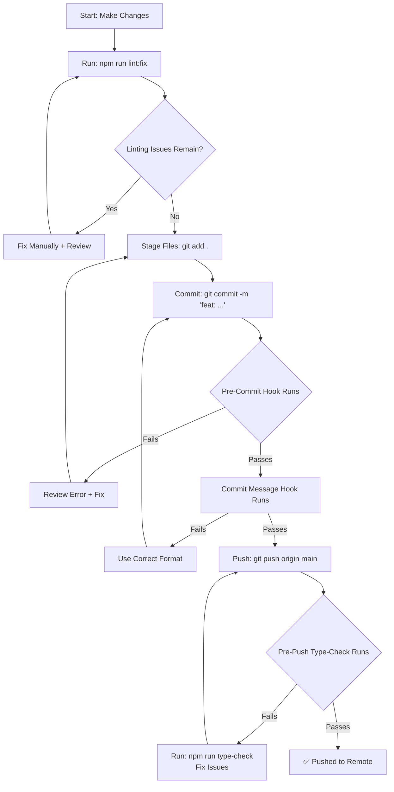

# MH Construction – Local Development Setup

**Purpose:** Prevent commit/push failures by understanding what pre-commit hooks check locally before sending code to GitHub.

**Status:** ✅ Active — June 22, 2026

---

## Quick Start: Avoiding Pre-Commit Hook Failures

Your development environment automatically runs quality checks **before you commit or push**. Here's what each check does and how to fix failures:

### 1. Pre-Commit Hook: ESLint + Prettier (Runs on `git commit`)

**What it checks:**

- Code formatting consistency
- Import statement best practices (e.g., `no-duplicate-imports`)
- Unused variables, dead code
- TypeScript type safety
- React/Next.js best practices
- Accessibility issues

**Common failures & fixes:**

| Error                                            | Root Cause                                      | Fix                                                                                                                                                         |
| ------------------------------------------------ | ----------------------------------------------- | ----------------------------------------------------------------------------------------------------------------------------------------------------------- |
| `'react' import is duplicated`                   | Two separate import statements from same module | **Merge imports:** Change `import { useState } from 'react'; import type { ReactNode } from 'react';` → `import { useState, type ReactNode } from 'react';` |
| `Parsing error: The keyword 'await' is reserved` | Missing `async` keyword on function             | Add `async` before the function: `async function myFunc() { await ... }`                                                                                    |
| `prettier` formatting failure                    | Code doesn't match project style                | Run `npm run lint:fix` to auto-format                                                                                                                       |
| `Image filename not kebab-case`                  | Added/renamed image with invalid name           | Rename file to lowercase kebab-case: `MyTeamPhoto.jpg` → `my-team-photo.webp`                                                                               |

**How to avoid (pre-commit):**

```bash
# Before you `git add`, fix issues locally
npm run lint:fix          # Auto-fixes formatting + simple issues
npm run lint              # Shows remaining issues to fix manually
git add .                 # Now safe to add
git commit -m "feat: ..."  # Pre-commit hook will pass
```

---

### 2. Commit Message Hook: Commitlint (Runs on `git commit -m`)

**What it checks:**

- Commit message follows [Conventional Commits](https://www.conventionalcommits.org/) format
- Message type is valid (feat, fix, docs, etc.)
- Subject is not empty

**Common failures & fixes:**

| Error                      | Root Cause                                         | Fix                                                                 |
| -------------------------- | -------------------------------------------------- | ------------------------------------------------------------------- |
| `type may not be empty`    | Message like `"Update header"` without type prefix | Use format: `"feat: update header"` or `"fix: resolve header bug"`  |
| `subject may not be empty` | Message like `"feat:"` with no description         | Add subject: `"feat: make header sticky on scroll"`                 |
| `type is not one of`       | Type like `"new"` instead of `"feat"`              | Use valid types: `feat`, `fix`, `docs`, `refactor`, `test`, `chore` |

**How to avoid:**

```bash
# ✅ Good commit messages
git commit -m "feat: add sticky header to all pages"
git commit -m "fix: resolve duplicate React import in Timeline"
git commit -m "docs: update development setup guide"
git commit -m "refactor: consolidate hero section height logic"

# ❌ Bad commit messages (will be rejected)
git commit -m "Update stuff"         # No type prefix
git commit -m "Fixed bug"            # Capitalized, no type
git commit -m "feat:"                # Type but no subject
git commit -m "FEAT: Add Header"     # Uppercase type
```

---

### 3. Pre-Push Hook: TypeScript Type-Check (Runs on `git push`)

**What it checks:**

- Full TypeScript compilation with `--noEmit` (doesn't generate files, just validates)
- All type errors across the entire codebase
- Cross-file type references

**Common failures & fixes:**

| Error                                                           | Root Cause                              | Fix                                                                                                  |
| --------------------------------------------------------------- | --------------------------------------- | ---------------------------------------------------------------------------------------------------- |
| `Type 'number \| undefined' is not assignable to type 'number'` | Passing optional value to required prop | Use conditional spread: `{...(typeof value === 'number' ? { prop: value } : {})}` or provide default |
| `Property 'X' does not exist on type 'Y'`                       | Typo in property name or missing type   | Check spelling, add type to object, or add missing interface property                                |
| `Cannot find name 'X'`                                          | Variable not imported or not declared   | Import the module or declare the variable                                                            |

**How to avoid (pre-push):**

```bash
# Run type-check locally BEFORE pushing
npm run type-check

# If it passes, push is safe
git push origin main

# If it fails, fix issues then retry
npm run type-check      # Validate fixes
git push origin main    # Now safe
```

---

## Setup Your IDE/Editor

### VS Code (Recommended)

**Install these extensions:**

- `ESLint` (Microsoft)
- `Prettier` (Prettier)
- `TypeScript Vue Plugin` (Vue — if working on other projects)

**VS Code workspace settings (`.vscode/settings.json`):**

```json
{
  "editor.formatOnSave": true,
  "editor.defaultFormatter": "esbenp.prettier-vscode",
  "editor.codeActionsOnSave": {
    "source.fixAll.eslint": true
  },
  "[typescript]": {
    "editor.defaultFormatter": "esbenp.prettier-vscode"
  },
  "[typescriptreact]": {
    "editor.defaultFormatter": "esbenp.prettier-vscode"
  }
}
```

**Result:** ESLint errors and import issues appear **inline as you type**, and Prettier auto-formats on save. Catch issues before committing.

---

## Development Workflow Summary



---

## Typical Development Day

```bash
# Morning: Sync with latest
git pull origin main

# Work on feature
npm run dev              # Start dev server
# Make changes in your editor
# (ESLint + Prettier run automatically)

# Before lunch: Commit work
npm run lint:fix        # Clean up formatting
npm run type-check      # Catch type errors early
git add .
git commit -m "feat: implement new feature"

# End of day: Push when ready for review
npm run build           # Final build test
git push origin main    # Pre-push hook validates
# If pre-push hook fails, type-check locally, fix, retry
```

---

## When Pre-Commit Hooks Fail

**Don't panic.** The hooks exist to prevent bad code reaching main. Here's the process:

1. **Read the error carefully** — it tells you exactly what's wrong
2. **Look up the fix in the table above** or search the error message
3. **Make the change**
4. **Re-run the local check** that failed:
   ```bash
   npm run lint:fix       # For ESLint issues
   npm run type-check     # For TypeScript issues
   ```
5. **Retry the commit/push**:
   ```bash
   git add .
   git commit -m "..."    # Hooks run again automatically
   ```

---

## Disabling Hooks (Not Recommended)

If you absolutely must bypass hooks for an emergency fix, you can skip them:

```bash
# Skip pre-commit hook only
git commit --no-verify -m "hotfix: critical production issue"

# Skip pre-push hook only
git push --no-verify origin main
```

⚠️ **Only use this for genuine hotfixes.** The hooks exist for a reason — bad code in main causes production issues.

---

## Questions or Issues?

- **ESLint rule unclear?** → See [eslint.config.mjs](../eslint.config.mjs) comments
- **Commit format questions?** → [Conventional Commits](https://www.conventionalcommits.org/)
- **TypeScript errors?** → Run `npm run type-check` for details; use [TypeScript handbook](https://www.typescriptlang.org/docs/)
- **Still stuck?** → Check [Contributing Guide](../contributing.md) for full workflow

Happy coding! 🚀
